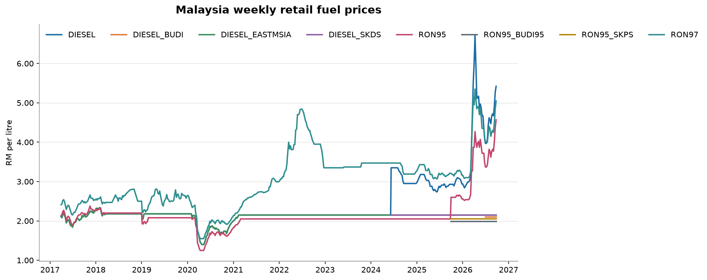

# Malaysia Fuel Watch

An end-to-end data pipeline that tracks Malaysia's weekly retail fuel prices — ingesting the
official dataset from [data.gov.my](https://data.gov.my/data-catalogue/fuelprice), modelling it in
DuckDB, testing it, and publishing a refreshed report every Thursday morning without anyone
touching a keyboard.

[](https://github.com/yuhanz7/malaysia-fuel-watch/actions/workflows/ci.yml)
[](https://github.com/yuhanz7/malaysia-fuel-watch/actions/workflows/weekly-refresh.yml)

**➡️ [Open the live dashboard](https://yuhanz7.github.io/malaysia-fuel-watch/)** · [read the Markdown report](docs/REPORT.md)



---

## Why this project

RON95, RON97 and diesel prices are re-announced every Wednesday and take effect Thursday. The
government publishes the full history as a single parquet file, but nobody publishes the *analysis*
— how volatile each grade has been, where today's price sits inside its own 52-week range, or which
weeks saw the biggest moves.

This repository does that, and does it the way a data team would: raw data is snapshotted and never
mutated, transformations live in version-controlled SQL, the output is tested before it is
published, and the whole thing runs on a schedule.

## Architecture

```
  data.gov.my (parquet, weekly)
            │
            ▼
  ┌──────────────────┐   snapshot_date=YYYY-MM-DD/
  │  1. INGEST       │   immutable raw layer + manifest
  │  pipeline/ingest │   (rows, date span, SHA-256, fetched_at)
  └────────┬─────────┘
           ▼
  ┌──────────────────┐   sql/01 → sql/05, executed in order
  │  2. TRANSFORM    │   staging → fact → marts
  │  DuckDB + SQL    │   wide-to-long, window functions, ASOF join
  └────────┬─────────┘
           ▼
  ┌──────────────────┐   8 checks, error vs warn severity
  │  3. VALIDATE     │   results persisted to dq_results
  │  pipeline/quality│   a blocking failure stops publication
  └────────┬─────────┘
           ▼
  ┌──────────────────┐   docs/index.html (dashboard) + REPORT.md + 4 charts
  │  4. PUBLISH      │   committed by GitHub Actions each Thursday,
  └──────────────────┘   served straight from GitHub Pages
```

## Quickstart

```bash
git clone https://github.com/yuhanz7/malaysia-fuel-watch.git
cd malaysia-fuel-watch
pip install -r requirements.txt

make run        # full pipeline against the live source
make offline    # same pipeline against the bundled sample data, no internet needed
make test       # 33 tests
```

Individual stages:

```bash
python -m pipeline.run ingest    # refresh the raw snapshot only
python -m pipeline.run build     # rebuild the warehouse from the last snapshot
python -m pipeline.run quality   # re-run the data quality checks
python -m pipeline.run report    # regenerate charts, the report and the dashboard
```

Then query the warehouse directly:

```sql
-- duckdb warehouse/fuel_watch.duckdb
SELECT fuel_type, latest_price_rm, pct_vs_52w_avg, yoy_change_pct
FROM mart_fuel_price_summary;
```

## The dashboard

`docs/index.html` is a single self-contained page: the data is embedded as JSON, the chart is
hand-written SVG, and there is no framework or build step. Publish it by going to
**Settings → Pages → Build and deployment**, choosing *Deploy from a branch*, and selecting
`main` with the `/docs` folder. The weekly workflow commits a refreshed page, so the site updates
itself.

The page carries the same ⚠️ sample-data banner as the report if it was built offline, so a
fixture-generated site can never be mistaken for the real thing.

## The data model

| Model | Grain | What it holds |
| --- | --- | --- |
| `raw_fuel_price` | as published | Untouched snapshot, both the `level` and `change` series |
| `stg_fuel_price` | grade × week | Wide-to-long reshape, typed, deduplicated, levels only |
| `fct_fuel_price_weekly` | grade × week | Week-on-week change, movement label, 52-week rolling average |
| `mart_fuel_price_summary` | grade | Latest price vs its 52-week range, year-on-year, all-time extremes |
| `mart_annual_stats` | grade × year | Average, range, volatility (σ), net change, weeks up/down/flat |
| `mart_biggest_moves` | grade × rank | The five largest single-week moves on record |

## Data quality

Every run executes eight checks and writes the results to a `dq_results` table, so failures are a
queryable history rather than a lost console message.

| Check | Severity | Guarantees |
| --- | --- | --- |
| `not_null_core_fields` | error | Date, grade and price are always present |
| `unique_grain` | error | Exactly one row per grade per week |
| `non_empty_fact` | error | The build produced data |
| `price_within_plausible_range` | error | Prices between RM0.50 and RM15.00 — catches a unit change upstream |
| `chronological_integrity` | error | Nothing is dated in the future |
| `source_freshness` | error | The latest observation is under 21 days old |
| `implausible_weekly_move` | warn | Flags week-on-week moves above RM1.50 |
| `reporting_gaps` | warn | Flags gaps longer than 21 days in the series |

An `error` stops the pipeline before the report is published; a `warn` is surfaced in the report but
never blocks it. A broken upstream file should never quietly become a published chart.

## Design decisions

**Snapshot the raw layer, never overwrite it.** The publisher revises figures occasionally. Dated
partitions plus a manifest of row counts and content hashes turn "did the source change?" into a
question you can answer in one query.

**Business logic in SQL, orchestration in Python.** The five models in `sql/` are readable by anyone
who knows SQL. Python renders a few `{{ placeholders }}` and runs the files in order — a deliberately
small dbt-flavoured runner rather than logic buried in dataframe chains.

**Detect the schema instead of hardcoding it.** Price columns are discovered from the snapshot, so a
new fuel grade appearing upstream flows through the whole pipeline without a code change. There is a
test for exactly that.

**Test against a fixture, not the network.** `scripts/make_fixture.py` generates a synthetic sample
with the same shape as the real dataset, so the suite is fast, deterministic and runs in CI with no
external dependency. Corruption tests deliberately break the warehouse and assert the right check
catches it — a check that can never fail is worse than no check.

**Idempotency by default.** Re-running ingest on the same day reuses the snapshot; re-running the
build recreates every model from scratch. There is no state to get out of sync.

## Project structure

```
malaysia-fuel-watch/
├── config/sources.yml           # source URL, schema hints, quality thresholds
├── pipeline/
│   ├── config.py                # typed config + path resolution
│   ├── ingest.py                # download, snapshot, manifest
│   ├── warehouse.py             # schema detection, SQL templating, model runner
│   ├── quality.py               # data quality checks and severity handling
│   ├── analyze.py               # chart generation
│   ├── report.py                # Markdown report generation
│   ├── publish.py               # static dashboard generation
│   ├── templates/dashboard.html # page template, data injected at build time
│   └── run.py                   # CLI
├── sql/                         # 5 numbered models: staging → fact → marts
├── tests/                       # 33 tests, no network required
├── scripts/make_fixture.py      # synthetic sample data generator
├── docs/                        # generated dashboard, report and charts (GitHub Pages root)
└── .github/workflows/           # CI on every push, data refresh every Thursday
```

## Roadmap

- Add the state-level Consumer Price Index so fuel can be compared against overall cost of living
- Backfill Brent crude prices to quantify the lag between global oil and the pump under the APM
- Replace the hand-rolled SQL runner with dbt once a second source is added

## Data source and licence

Data: *Price of Petroleum & Diesel*, Ministry of Finance Malaysia, via
[data.gov.my](https://data.gov.my/data-catalogue/fuelprice), licensed
[CC BY 4.0](https://creativecommons.org/licenses/by/4.0/). This project is not affiliated with or
endorsed by the Government of Malaysia.

Code: MIT.
