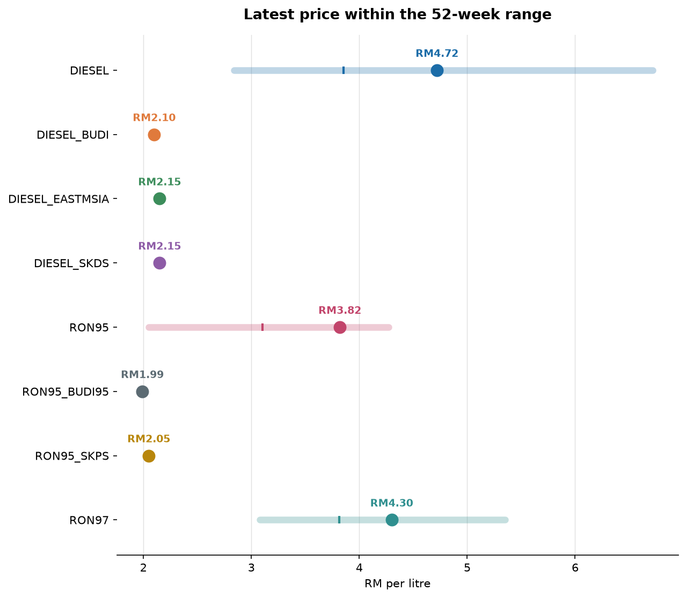
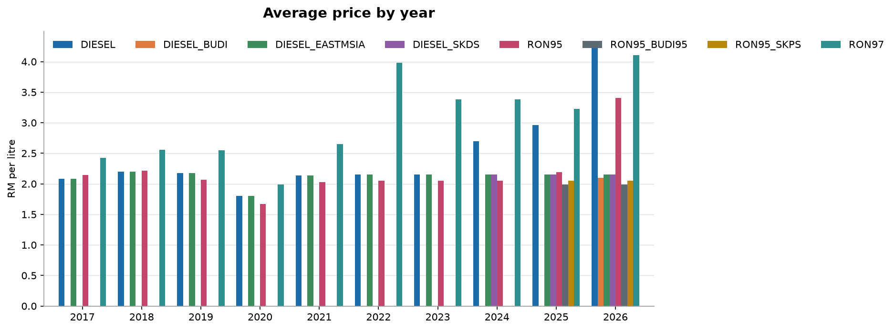
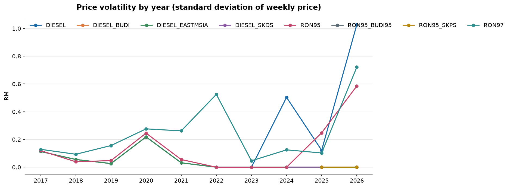

# Malaysia Fuel Watch — automated report

_Generated 2026-08-27 12:12 UTC by the pipeline in this repository. Do not edit by hand._

**Source:** [Ministry of Finance, via data.gov.my](https://data.gov.my/data-catalogue/fuelprice) · `https://storage.data.gov.my/commodities/fuelprice.parquet`
**Licence:** CC BY 4.0 · **Cadence:** weekly (announced Wednesday, effective Thursday)

## Headline

- Latest published week: **27 August 2026**.
- This week: DIESEL +0.05 to RM4.72; RON95 +0.05 to RM3.82; RON97 +0.05 to RM4.30.
- 3 of 8 grades sit above their own 52-week average, 0 below.
- DIESEL_BUDI is the least volatile grade on record — its price moved in only 0% of tracked weeks.

## Where prices stand

| Grade | Latest | Week on week | 52-week range | vs 52-week avg | Year on year | Weeks tracked |
| --- | --- | --- | --- | --- | --- | --- |
| DIESEL | RM4.72 | +0.05 | RM2.84 – RM6.72 | +22.44% | +65.61% | 476 |
| DIESEL_BUDI | RM2.10 | no change | RM2.10 – RM2.10 | no change | n/a | 9 |
| DIESEL_EASTMSIA | RM2.15 | no change | RM2.15 – RM2.15 | no change | no change | 476 |
| DIESEL_SKDS | RM2.15 | no change | RM2.15 – RM2.15 | no change | no change | 117 |
| RON95 | RM3.82 | +0.05 | RM2.05 – RM4.27 | +23.16% | +86.34% | 476 |
| RON95_BUDI95 | RM1.99 | no change | RM1.99 – RM1.99 | no change | n/a | 48 |
| RON95_SKPS | RM2.05 | no change | RM2.05 – RM2.05 | no change | n/a | 48 |
| RON97 | RM4.30 | +0.05 | RM3.08 – RM5.35 | +12.66% | +37.38% | 476 |

## Price history

## Year by year

| Year | Grade | Average | Range | Volatility (σ) | Net change | Weeks up | Weeks down | Weeks flat |
| --- | --- | --- | --- | --- | --- | --- | --- | --- |
| 2026 | DIESEL | RM4.28 | RM2.84 – RM6.72 | 1.027 | +60.54% | 18 | 12 | 5 |
| 2026 | DIESEL_BUDI | RM2.10 | RM2.10 – RM2.10 | 0.000 | no change | 0 | 0 | 8 |
| 2026 | DIESEL_EASTMSIA | RM2.15 | RM2.15 – RM2.15 | 0.000 | no change | 0 | 0 | 35 |
| 2026 | DIESEL_SKDS | RM2.15 | RM2.15 – RM2.15 | 0.000 | no change | 0 | 0 | 35 |
| 2026 | RON95 | RM3.40 | RM2.52 – RM4.27 | 0.585 | +49.22% | 14 | 11 | 10 |
| 2026 | RON95_BUDI95 | RM1.99 | RM1.99 – RM1.99 | 0.000 | no change | 0 | 0 | 35 |
| 2026 | RON95_SKPS | RM2.05 | RM2.05 – RM2.05 | 0.000 | no change | 0 | 0 | 35 |
| 2026 | RON97 | RM4.11 | RM3.08 – RM5.35 | 0.721 | +36.08% | 13 | 12 | 10 |
| 2025 | DIESEL | RM2.96 | RM2.74 – RM3.18 | 0.122 | -1.34% | 18 | 17 | 17 |
| 2025 | DIESEL_EASTMSIA | RM2.15 | RM2.15 – RM2.15 | 0.000 | no change | 0 | 0 | 52 |
| 2025 | DIESEL_SKDS | RM2.15 | RM2.15 – RM2.15 | 0.000 | no change | 0 | 0 | 52 |
| 2025 | RON95 | RM2.19 | RM2.05 – RM2.66 | 0.248 | +24.88% | 3 | 4 | 45 |
| 2025 | RON95_BUDI95 | RM1.99 | RM1.99 – RM1.99 | 0.000 | no change | 0 | 0 | 12 |
| 2025 | RON95_SKPS | RM2.05 | RM2.05 – RM2.05 | 0.000 | no change | 0 | 0 | 12 |
| 2025 | RON97 | RM3.23 | RM3.07 – RM3.43 | 0.103 | -3.66% | 16 | 16 | 20 |
| 2024 | DIESEL | RM2.70 | RM2.15 – RM3.35 | 0.503 | +37.21% | 1 | 7 | 45 |
| 2024 | DIESEL_EASTMSIA | RM2.15 | RM2.15 – RM2.15 | 0.000 | no change | 0 | 0 | 53 |
| 2024 | DIESEL_SKDS | RM2.15 | RM2.15 – RM2.15 | 0.000 | no change | 0 | 0 | 29 |
| 2024 | RON95 | RM2.05 | RM2.05 – RM2.05 | 0.000 | no change | 0 | 0 | 53 |
| 2024 | RON97 | RM3.39 | RM3.19 – RM3.47 | 0.125 | -6.34% | 2 | 4 | 47 |
| 2023 | DIESEL | RM2.15 | RM2.15 – RM2.15 | 0.000 | no change | 0 | 0 | 52 |
| 2023 | DIESEL_EASTMSIA | RM2.15 | RM2.15 – RM2.15 | 0.000 | no change | 0 | 0 | 52 |
| 2023 | RON95 | RM2.05 | RM2.05 – RM2.05 | 0.000 | no change | 0 | 0 | 52 |
| 2023 | RON97 | RM3.38 | RM3.35 – RM3.47 | 0.046 | +3.58% | 2 | 0 | 50 |
| 2022 | DIESEL | RM2.15 | RM2.15 – RM2.15 | 0.000 | no change | 0 | 0 | 52 |
| 2022 | DIESEL_EASTMSIA | RM2.15 | RM2.15 – RM2.15 | 0.000 | no change | 0 | 0 | 52 |
| 2022 | RON95 | RM2.05 | RM2.05 – RM2.05 | 0.000 | no change | 0 | 0 | 52 |
| 2022 | RON97 | RM3.98 | RM3.03 – RM4.84 | 0.525 | +10.56% | 17 | 19 | 16 |

## Largest weekly moves on record

| Grade | Week | Move | Move % | Price after |
| --- | --- | --- | --- | --- |
| DIESEL | 10 Jun 2024 | +1.20 | +55.81% | RM3.35 |
| DIESEL | 23 Apr 2026 | -0.85 | -14.24% | RM5.12 |
| DIESEL | 26 Mar 2026 | +0.80 | +16.95% | RM5.52 |
| DIESEL_EASTMSIA | 07 Mar 2020 | -0.17 | -7.98% | RM1.96 |
| DIESEL_EASTMSIA | 05 Jan 2019 | -0.14 | -6.42% | RM2.04 |
| DIESEL_EASTMSIA | 11 May 2017 | -0.13 | -6.25% | RM1.95 |
| RON95 | 26 Mar 2026 | +0.60 | +18.35% | RM3.87 |
| RON95 | 12 Mar 2026 | +0.60 | +22.47% | RM3.27 |
| RON95 | 30 Sep 2025 | +0.55 | +26.83% | RM2.60 |
| RON97 | 19 Mar 2026 | +0.70 | +18.18% | RM4.55 |
| RON97 | 26 Mar 2026 | +0.60 | +13.19% | RM5.15 |
| RON97 | 12 Mar 2026 | +0.60 | +18.46% | RM3.85 |

## Data quality

7 of 8 checks passed.

| Check | Severity | Result | What it guarantees |
| --- | --- | --- | --- |
| not_null_core_fields | error | pass | Every staged row has a date, a fuel grade and a price. |
| unique_grain | error | pass | The fact table has exactly one row per fuel grade per week. |
| non_empty_fact | error | pass | The fact table is not empty. |
| price_within_plausible_range | error | pass | Prices sit between RM0.50 and RM15.00 per litre. |
| chronological_integrity | error | pass | No observation is dated in the future. |
| source_freshness | error | pass | The latest observation is under 21 days old. |
| implausible_weekly_move | warn | pass | No week-on-week move exceeds RM1.50 per litre. |
| reporting_gaps | warn | fail (20 rows) | No gap longer than 21 days between consecutive observations. |

## Ingestion log

- Snapshots landed: **4**
- Latest snapshot: `2026-08-27` (951 source rows, 2017-03-30 to 2026-08-27)
- Source fingerprint: `f1fd9070d3f3780e…`

